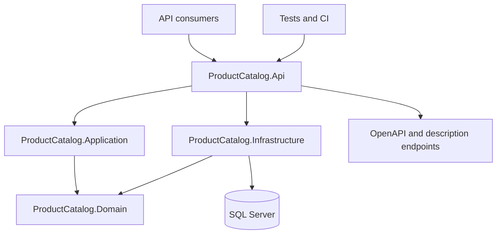

# ProductsCatalog

ProductsCatalog is a standalone product catalog service for an e-commerce platform. It owns product data, exposes HTTP APIs for catalog reads and writes, records MobilePhone change history, and publishes machine-readable descriptions of request flows and validation rules.

The catalog is separated from the rest of the platform because it has a distinct data model and scaling profile. Product browsing is read-heavy and can grow independently from ordering, payments, invoicing, and user management. Keeping the catalog behind its own API allows independent deployment, horizontal scaling, caching, and query optimization without coupling those decisions to transactional services.

## Engineering approach

### Design first, executable source of truth

API behavior is designed before implementation: routes, request and response models, validation rules, status codes, and acceptance scenarios are agreed first. The approved design is then expressed as executable code and tests.

The repository does not maintain a second handwritten OpenAPI file. Endpoint metadata and DTOs are the executable source used by Swashbuckle to generate OpenAPI. Reqnroll scenarios describe externally visible behavior. CI generates and validates the current OpenAPI document from the running application, so documentation cannot silently drift away from the implementation.

This combines design-first governance with code-generated artifacts:

1. define the contract and behavior;
2. implement endpoint metadata, DTOs, validation, and flow descriptors;
3. prove behavior with unit, integration, and acceptance tests;
4. derive OpenAPI, flow and validation descriptions, operation links, and
   acceptance results from those sources;
5. validate the contract and exercised HTTP responses in CI.

### Description Pattern and RAG-ready documentation

Application flows are intentionally self-describing. Flow descriptor methods use ordered `FlowStep` metadata, while validation policies expose rule descriptors and possible errors. The API makes these descriptions available through:

- `GET /products-documentation/flow`;
- `GET /products-documentation/validation-policies`.

CI derives operation-to-flow-to-policy-to-scenario links from the code and
acceptance matrix. It rejects missing or duplicate relationships, exports and
lints OpenAPI, and compares declared responses with the HTTP behavior exercised
by acceptance tests. Generated projections are ignored build artifacts, not
another specification committed to the repository. Publishing an Allure/API
portal and building RAG ingestion are later work; see [the backlog](docs/backlog.md).

## Architecture



| Layer | Responsibility |
|---|---|
| `ProductCatalog.Api` | Minimal API endpoints, HTTP contracts, exception mapping, OpenAPI, health checks, and composition root. |
| `ProductCatalog.Application` | Commands, queries, MediatR handlers, mapping, validation orchestration, logging behavior, and flow descriptions. |
| `ProductCatalog.Domain` | Aggregates, value objects, repository contracts, validation policies, rules, and domain errors. |
| `ProductCatalog.Infrastructure` | SQL Server access, EF Core command persistence, Dapper queries, migrations, repositories, and readiness checks. |

The service uses CQRS inside one deployable application. Commands work with domain aggregates and EF Core. Queries use Dapper and dedicated read models for explicit SQL and efficient projections. MediatR dispatches commands and queries without exposing infrastructure concerns to the API layer.

## Why SQL Server

The catalog is relational. Mobile phones have current and history records, and read use cases need filtering and projections. SQL Server provides transactions, indexing, and operational tooling suitable for this model.

EF Core is used where aggregate persistence and migrations matter. Dapper is used on the query side where explicit SQL and narrow result sets are more useful. See [ADR-0001](docs/adr/0001-use-sql-server.md).

## Technology stack

| Area | Technology |
|---|---|
| Runtime and API | .NET 10, ASP.NET Core Minimal APIs |
| Application flow | MediatR, CQRS |
| Domain mapping | Mapster |
| Database | SQL Server 2022 |
| Write persistence | Entity Framework Core 10 |
| Read persistence | Dapper |
| API contract | Swashbuckle OpenAPI, Redocly CLI validation |
| Logging | Serilog structured console logging |
| Unit tests | xUnit, Shouldly, Moq |
| Acceptance tests | Reqnroll, xUnit, Allure |
| Integration infrastructure | Testcontainers for SQL Server |
| Coverage | Coverlet collector, ReportGenerator |
| Containers | Docker, Docker Compose |
| CI/CD | GitHub Actions, Dependency Review, Gitleaks, Trivy |

## Repository structure

```text
src/
  ProductCatalog.Api/
  ProductCatalog.Application/
  ProductCatalog.Domain/
  ProductCatalog.Infrastructure/
tests/
  ProductCatalog.Acceptance.Tests/
  ProductCatalog.Domain.UnitTests/
  ProductsCatalog.Application.UnitTests/
  ProductsCatalog.Infrastructure.UnitTests/
  ProductsCatalog.Performance.BenchmarkTests/
docs/
  adr/
  backlog.md
  database-migrations.md
```

## Prerequisites

- .NET SDK `10.0.100` or a newer .NET 10 feature band (selected by `global.json`);
- Docker Engine or Docker Desktop;
- Bash, Python 3, curl, and Node.js 22 for the complete local verification command;
- Git;
- optional: `dotnet-ef` for migration commands;
- optional: Allure 2 CLI for a local acceptance report.

## Run locally

Start SQL Server:

```powershell
Copy-Item .env.example .env
# Set a strong MSSQL_SA_PASSWORD value in .env.
docker compose up -d product-db
```

Configure the API and start it:

```powershell
$env:ConnectionStrings__ProductCatalogDb = "Server=localhost,1433;Database=ProductsDb;User Id=sa;Password=<password-from-env>;TrustServerCertificate=True"
$env:Database__ApplyMigrations = "true"
dotnet run --project src/ProductCatalog.Api/ProductCatalog.Api.csproj
```

`Database__ApplyMigrations=true` is intended for local development. Hosted environments should apply migrations in a dedicated deployment step.
Repeated opt-in local starts preserve the seeded phones and their history. A failed
migration stops startup and is not retried as a whole; see
[the migration strategy](docs/database-migrations.md) for recovery and the separate
CLEAN-01 existing-data verification.

The API checks the SQL connection string and the optional `Database:ApplyMigrations`
boolean at startup. The connection string must specify `Server` and `Database`;
invalid settings stop startup with an error that does not print credentials.
Missing `Database:ApplyMigrations` means `false`. Configuration validation does
not connect to SQL Server: with migrations disabled, OpenAPI can be generated
while SQL is unavailable. `/health/ready` separately checks SQL availability
and access to the current mobile phone and history tables.

After startup, use the URLs printed by ASP.NET Core. Swagger UI is available at `/swagger`, and the OpenAPI document is available at `/swagger/v1/swagger.json`.

## Run with Docker Compose

Build the API image and start the complete local stack:

```powershell
Copy-Item .env.example .env
# Set MSSQL_SA_PASSWORD and optionally APPLY_MIGRATIONS=true in .env.
docker build -f src/ProductCatalog.Api/Dockerfile -t productcatalogapi:latest .
docker compose up -d
```

The API is exposed at `http://localhost:5000`, and SQL Server at `localhost:1433`.

Stop the containers without deleting database data:

```powershell
docker compose down
```

Remove the containers and the local SQL volume:

```powershell
docker compose down --volumes
```

## Database migrations

Install the EF Core tool if required:

```powershell
dotnet tool install --global dotnet-ef
```

Create a migration:

```powershell
dotnet ef migrations add <MigrationName> --project src/ProductCatalog.Infrastructure --startup-project src/ProductCatalog.Api
```

Apply migrations manually:

```powershell
dotnet ef database update --project src/ProductCatalog.Infrastructure --startup-project src/ProductCatalog.Api
```

Generate an idempotent deployment script:

```powershell
dotnet ef migrations script --idempotent --project src/ProductCatalog.Infrastructure --startup-project src/ProductCatalog.Api --output artifacts/migrations.sql
```

Runtime migrations are disabled by default to prevent multiple replicas from modifying the schema during scale-out. See [the migration strategy](docs/database-migrations.md) and [ADR-0004](docs/adr/0004-database-migration-strategy.md).

## API contract and executable documentation

Swagger UI is available at `/swagger` and the generated contract at
`/swagger/v1/swagger.json`. CI derives named operations, flow and validation
policies, HTTP statuses and scenario IDs from executable sources. For current
methods, routes, payloads and responses use the generated OpenAPI; for tested
status/cause branches use the [acceptance matrix](docs/acceptance-matrix.md).
The public [problem contract](docs/api-problem-contract.md) describes stable
error codes. No handwritten per-operation catalogue is maintained here.

The API exposes flow descriptions at `/products-documentation/flow` and domain
policy descriptions at `/products-documentation/validation-policies`. Updates
with unchanged information and deletes of already inactive phones do not add a
history entry. The `top` read means the three most recently changed active
phones, not sales or popularity. List reads return empty arrays when no active
phones match; an existing inactive phone remains readable by ID. History pages
have deterministic `ChangedAt DESC, Id DESC` ordering.

Categories and Currencies endpoints were removed. MobilePhone requests,
responses, history, and SQL tables no longer have `CategoryId`.
`Price.Currency` remains the three-letter currency code in the price value
object, not a lookup into Currencies. Clients still sending `CategoryId` must
update their request and regenerate any client from current OpenAPI.

The EF migration `20260922220000_RemoveCatalogs` removes the old catalogue
current/history tables and `CategoryId` columns. Back up an existing database
before applying it: removed values cannot be reconstructed by rolling back.
Its behavior on a populated pre-cleanup database remains unverified under
CLEAN-01; see [migration guidance](docs/database-migrations.md).

## Health checks

| Route | Meaning |
|---|---|
| `/health/live` | The API process is running. It does not depend on SQL Server. |
| `/health/ready` | SQL Server can read the mobile phone and history tables within the five-second check timeout; otherwise `503` (plain-text health response). |

Use liveness for process restart decisions and readiness for load-balancer routing.
Readiness runs a zero-row schema probe and does not require product data. It does
not apply migrations, retry an entire startup, or change the opt-in migration policy.

Dapper catalog reads have a 12-second overall deadline and a five-second SQL command
timeout. Opening a connection is limited to three seconds per attempt and may be
retried twice for selected transient connection errors (with 0.5/1-second delays).
Once a connection is open, a failed query is never retried: callers may receive an
error even if the database later recovers. Request cancellation stops the opening,
delay or query. EF Core command writes retain their separate existing retry policy;
this read policy never repeats a write, transaction, migration or startup.

## Tests

From the repository root, run source-link and architecture checks, the complete
local build, formatting, four test suites, separate 70% coverage checks,
OpenAPI lint and Docker build with one command:

```bash
bash scripts/verify.sh
```

The script writes TRX, coverage and the generated OpenAPI to the ignored
`artifacts/verification` directory. Infrastructure tests produce a separate HTML
and text coverage report for diagnosis without a percentage threshold; Domain
and Application retain separate 70% line-coverage gates. CI publishes the
Infrastructure report in the job summary and as an artifact. CI additionally
checks dependencies, secrets and image vulnerabilities. The Docker build stage
uses SDK 10.0.100. CI selects the SDK through `setup-dotnet` and `global.json`,
which allows newer .NET 10 feature bands.

Restore and build the solution:

```powershell
dotnet restore ProductsCatalog.sln
dotnet build ProductsCatalog.sln --configuration Release --no-restore
dotnet format ProductsCatalog.sln --verify-no-changes --no-restore
```

Run the test projects:

```powershell
dotnet test tests/ProductCatalog.Domain.UnitTests/ProductCatalog.Domain.UnitTests.csproj --configuration Release
dotnet test tests/ProductsCatalog.Application.UnitTests/ProductsCatalog.Application.UnitTests.csproj --configuration Release
dotnet test tests/ProductsCatalog.Infrastructure.UnitTests/ProductsCatalog.Infrastructure.UnitTests.csproj --configuration Release
dotnet test tests/ProductCatalog.Acceptance.Tests/ProductCatalog.Acceptance.Tests.csproj --configuration Release
```

Infrastructure and acceptance tests require Docker because SQL Server is created through Testcontainers. Acceptance tests start one SQL Server container per test run; each Reqnroll scenario gets a separate migrated database, API host, and HTTP client. The scenario hook releases the client and host and drops the database even when a scenario fails. Acceptance scenarios verify HTTP status codes, response bodies, validation details, empty collections, missing resources, and safe server-error responses.

Run benchmarks separately:

```powershell
dotnet run --configuration Release --project tests/ProductsCatalog.Performance.BenchmarkTests/ProductsCatalog.Performance.BenchmarkTests.csproj
```

Generate a local Allure report:

```powershell
npm install --global allure-commandline@2
dotnet test tests/ProductCatalog.Acceptance.Tests/ProductCatalog.Acceptance.Tests.csproj
allure generate artifacts/allure-results/acceptance -o artifacts/allure-report --clean
allure open artifacts/allure-report
```

Generated `.feature.cs` files are build artifacts and must not be edited manually.

## CI/CD pipeline

GitHub Actions runs for pull requests and pushes to `master`:

1. restore, Release build, and format verification;
2. check acceptance/source/architecture links, start the API, generate OpenAPI,
   and validate it with a pinned Redocly CLI and runtime acceptance assertions;
3. run Domain, Application, Infrastructure, and acceptance tests;
4. enforce separate 70% line-coverage gates for Domain and Application; report
   Infrastructure coverage without a percentage gate;
5. run Dependency Review on pull requests and Gitleaks secret scanning;
6. build the container and fail on high or critical Trivy findings;
7. after scanning, tag and publish the same local image as commit-SHA and `latest`
   to Docker Hub on `master`, verifying matching image IDs and registry digests.

The image build depends on a quality gate that requires successful build/OpenAPI, tests with separate 70% Domain/Application coverage, secret scanning, and Dependency Review on pull requests. On a push, Dependency Review is expected to be skipped. The build, Trivy scan and conditional Docker Hub publication run in the same job, without rebuilding. A failed required check or high/critical container vulnerability blocks publication. Test result artifacts are uploaded even when a test fails.

NuGet audit is enabled for all restores through `Directory.Build.props`. Automatic Dependency Submission maintains the dependency graph. Dependabot remains intentionally disabled.

## Scaling and operations

The API is stateless; durable state stays in SQL Server. Multiple API replicas can therefore serve catalog reads behind a load balancer. Read-heavy endpoints can be scaled independently from other e-commerce services, while Dapper queries, SQL indexes, and future caching can be optimized without changing the order or payment domains.

Database migrations are executed once before rollout rather than by every replica. Readiness prevents traffic from reaching an instance when SQL Server is unavailable, while liveness remains independent of external dependencies.

## Architecture decisions

The [ADR index](docs/adr/README.md) covers SQL/CQRS, contracts, migration,
source documentation, errors, acceptance isolation, concurrency and image
publication. It distinguishes decisions implemented now from later hosting
and retrieval work.

Current work and intentional exclusions are recorded in [the repository backlog](docs/backlog.md).
